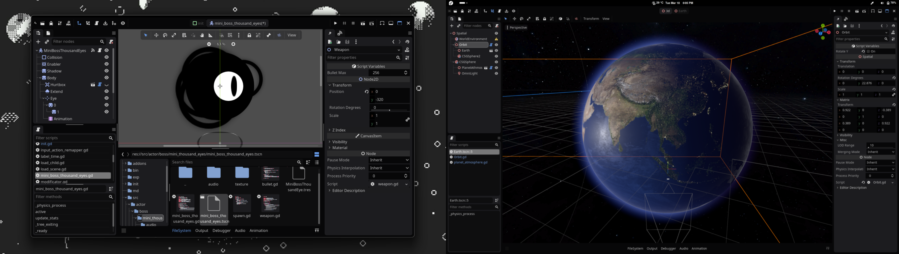
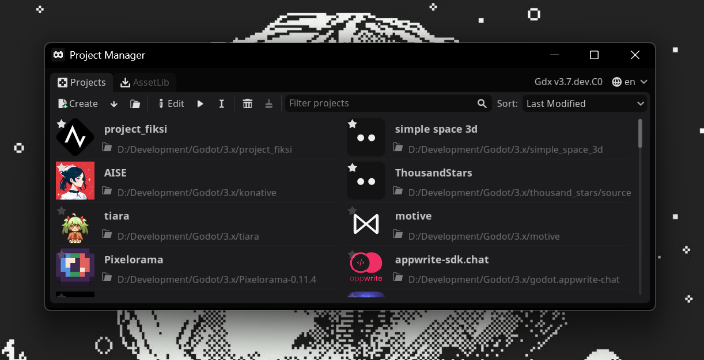

#  GDX

[](https://github.com/naiiveprojects/GDX/releases/latest)
[](https://github.com/naiiveprojects/GDX/commits/3.x)
[](https://github.com/naiiveprojects/GDX/pulse/monthly)
[](https://github.com/naiiveprojects/GDX/pulse/monthly)

GDX is a custom [**Godot Engine 3.x branch**](https://github.com/godotengine/godot/tree/3.x). For more detail, refer to [**this changelog**](thirdparty/gdx/CHANGELOG.md). This fork continuously tracks the latest development of the [`3.x branch`](https://github.com/godotengine/godot/tree/3.x).

<p align="center">
    
    
</p>

## Binaries

The [releases](https://github.com/naiiveprojects/GDX/releases/latest) utilize [Github Actions](https://github.com/naiiveprojects/GDX/actions) artifacts, with the following flags applied for all builds: `debug_symbols=no lto=full production=yes optimize=size deprecated=no`

Additionally, builds compiled with the following encryption key:

```hex
FEE1ADDC0FFEEDEC0DEDEFDEADC0DEDECADEDEC0DEC0FFEEC0DEC0FFEEC0FFEE
```

> [!WARNING]
> This encryption key is publicly accessible. If you prefer to use a more secure key for encryption, refer to the [compiling with script encryption key](https://docs.godotengine.org/en/3.6/development/compiling/compiling_with_script_encryption_key.html).

To minimize compilation time and binary size, builds are provided only for the following architectures:

| Platform  | Editor  | Template  |
|-----------|---------|-----------|
| Android   | armv7   | armv7     |
| iOS       | -       | arm64v8   |
| Linux     | x64     | x64       |
| macOS     | universal (x64, arm64) | universal |
| Windows   | x64     | x64       |
| Web       | -       | Default, Threads |
| Server    | Linux Headless x64 | Linux Server x64 |

> [!NOTE]
> To add more platform / architectures, follow the [compilation guide](https://docs.godotengine.org/en/3.6/development/compiling/index.html).

### Download

- **Precompiled Binaries:** Available on the [Releases](https://github.com/naiiveprojects/GDX/releases/latest) page.
- **Latest Builds:** Check [Artifacts](https://github.com/naiiveprojects/GDX/actions) in GitHub Actions.
- **Manual Compilation:** get the source code [here](https://github.com/naiiveprojects/GDX/archive/refs/heads/3.x.zip) then Follow the [compilation guide](https://docs.godotengine.org/en/3.6/development/compiling/index.html).

GDX use **custom templates** for exporting the projects.

precompiled Binaries utilize `BUILD_NAME` for versioning using format YYMMDDHH, ex: `25033000`.

> [!CAUTION]
> These builds are considered bleeding-edge. It is strongly recommended to back up your projects or use version control systems like Git.

---

<p align="center">
    
</p>
