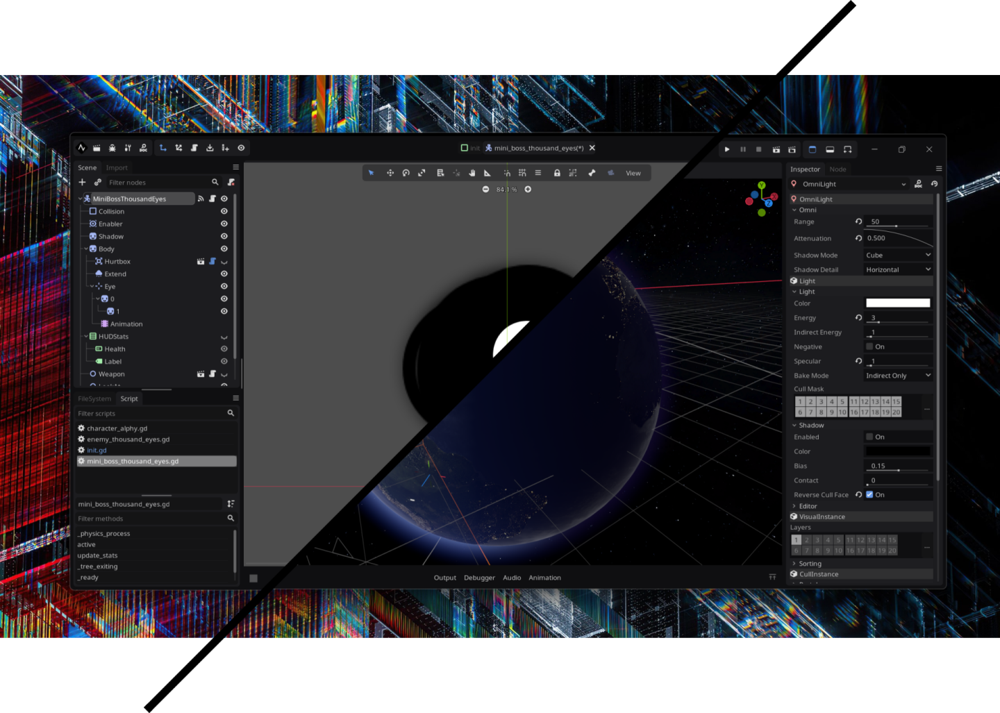
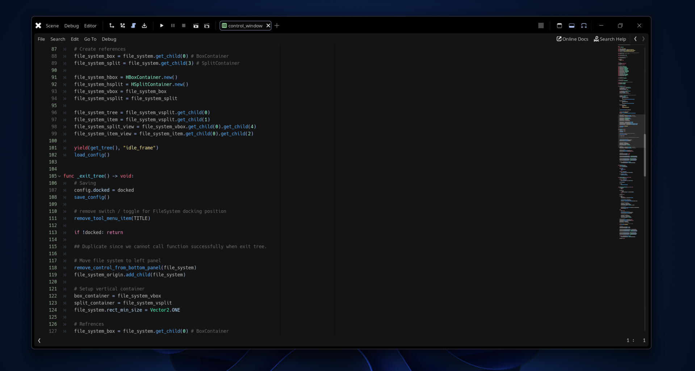

**gdx** is a custom latest version of the [**Godot Engine 3.x branch**](https://github.com/godotengine/godot/tree/3.x).
Its primary objective is to reduce its binary size, and add/refine/remove some of its functionality.

## Added

- [MiniZip Module](https://github.com/godotengine/godot/pull/34444)
- custom build script (custom.py)
- ProgressBar : [fill direction](https://github.com/godotengine/godot/pull/36593)
- Editor
  - borderless mode
  - show/hide bottom panel button
- Windows
  - dark mode in window title bar (non-client area)
  - resizable borderless window (call via script: `OS.window_borderless = true`)
  - colapse client area to non client area
- Android
  - proguard (reduce android build size)
- `& more ...`

## Changed

- change icons, logo, & splash
- dark initial color bg
- Editor
	- use project icon on project menu button
	- re-arrage title bar (Project Name, Edited Node Path)
	- revamp layout
	- minify icon
	- Dark default theme
	- editor log :
		- remove init message
		- change Output title to build version
	- colapse tool menu in canvas item editor
	- corner radius : 8
- default editor setting
	- Color Picker mode: HSV
	- clear color : 0.2, 0.2, 0.2
	- word_wrap : true
	- Type Hint: True
	- convert_text_resources_to_binary_on_export : true
	- text_editor/cursor/scroll_past_end_of_file : true
	- constrain_editor_view : false
	- always_open_output_on_play : false
	- (Debugger) auto switch to remove scene tree : True
	- auto_switch_to_remote_scene_tree : true
	- editors/2d/grid_color : Color(0.5, 0.5, 0.5, 0.07)
	- double max char/ces
	- file system file sort : FILE_SORT_TYPE 
	- inspector : hide general option, move history menu
- project manager
	- revamp layout
	- change grid container to flow container
	- not include default icon & environment when creating project
	- favorite ontop project icon
	- option on top
	- black background
	- re-arrage title bar ( + version full build + hash)
- default project manager
	- sorting_order : Last modified
- Github Action
  - no static checks
  - manual trigger
  - Android : compile armv7
  - Linux : Editor & Template
- `& more ...`
  
## Removed

- visual script
- deprecated features
- Editor
  - video driver toggle
  - version info button
  - help menu button
- `& more ...`

## ToDo

- 

---

`scons -c` `$env:BUILD_NAME="NA\\\\VE"`