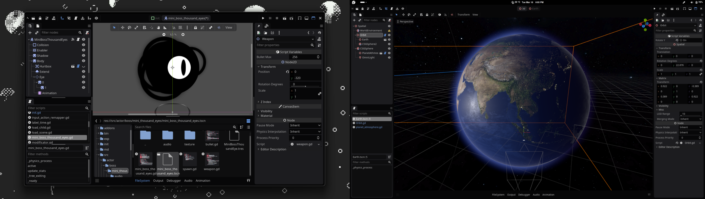
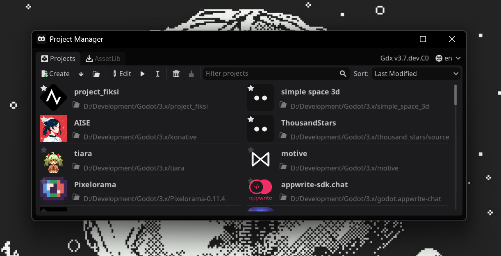

#  GDX  

A custom [**Godot Engine 3.x branch**](https://github.com/godotengine/godot/tree/3.x). See the [**changelog**](CHANGELOG_GDX.md) for details.  

  

  

## Usage  

> [!CAUTION]  
> This is a *bleeding-edge* build. Back up your projects or use a version control system like Git before using it.  

- **Download** the precompiled version from the [Releases](https://github.com/naiiveprojects/GDX/releases) page.  
- **For the latest build**, check the [Artifacts](https://github.com/naiiveprojects/GDX/actions) in GitHub Actions.  
- **To compile manually**, follow the [Godot Engine compilation guide](https://docs.godotengine.org/en/3.6/development/compiling/index.html).  

## Exporting  

This branch uses **custom templates** for exporting.  

- **Download** the templates from [Releases](https://github.com/naiiveprojects/GDX/releases).  
- **Find the latest templates** in [Artifacts](https://github.com/naiiveprojects/GDX/actions).  
- **Compile templates manually** by following the [Godot Engine compilation guide](https://docs.godotengine.org/en/3.6/development/compiling/index.html).  

---  

  
      

