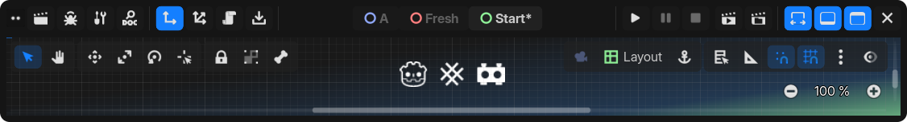

<center>



GDX is a custom [Godot Engine 3.x branch](https://github.com/godotengine/godot/tree/3.x). it aims to incorporate changes, additions, or merged features that may not be merged into the official branch.

[](https://github.com/naiiveprojects/GDX/releases/latest)
[](https://github.com/naiiveprojects/GDX/commits/3.x)
[](https://github.com/naiiveprojects/GDX/pulse/monthly)
[](https://github.com/naiiveprojects/GDX/pulse/monthly)

[](thirdparty/gdx/CHANGELOG.md)

refer to [**this Changelog**](thirdparty/gdx/CHANGELOG.md) for list of notable changes.

</center>

## 📦 Downloads

> [!CAUTION]
> These builds are considered *bleeding-edge*. It is strongly recommended to back up your projects or use version control systems like Git.

- **Releases Builds:** Available on the [Releases](https://github.com/naiiveprojects/GDX/releases/latest) page.
- **Latest Builds:** Check [Artifacts](https://github.com/naiiveprojects/GDX/actions) in GitHub Actions.
- **Source Code:** Get the archive [Here](https://github.com/naiiveprojects/GDX/archive/refs/heads/3.x.zip).

## ♾️ Automated Builds

Automated builds compiled with the following encryption key:

```hex
FEE1ADDC0FFEEDEC0DEDEFDEADC0DEDECADEDEC0DEC0FFEEC0DEC0FFEEC0FFEE
```

> [!NOTE]
> The [Releases](https://github.com/naiiveprojects/GDX/releases/latest) also utilize [GitHub Actions](https://github.com/naiiveprojects/GDX/actions) artifacts, you can use the encryption key on both Release or Latest Build.

> [!IMPORTANT]
> This encryption key is publicly accessible. If you prefer to use a more secure key for encryption, refer to the [compiling with script encryption key](https://docs.godotengine.org/en/3.6/development/compiling/compiling_with_script_encryption_key.html).

 We use the following flags for all builds: `debug_symbols=no lto=full production=yes optimize=size deprecated=no` with `BUILD_NAME` for versioning using format YYMMDDHH, e.g., `25033000`.

To optimize build times and minimize binaries size, GDX provides pre-built versions only for selected set of architectures below:

| Platform  | Editor  | Template  |
|-----------|---------|-----------|
| Android   | armv7   | armv7     |
| iOS       | -       | arm64v8   |
| Linux     | x64     | x64       |
| macOS     | universal (x64, arm64) | universal |
| Windows   | x64     | x64       |
| Web       | -       | Default, Threads |
| Server    | Linux Headless x64 | Linux Server x64 |

To add more platforms/architectures, follow the [compilation guide](https://docs.godotengine.org/en/3.6/development/compiling/index.html).

## 🤝 Contributing

We appreciate contributions!

- If you encounter any **bugs** or specific **issues**, please open an [Issue](https://github.com/naiiveprojects/GDX/issues).
- For **questions**, **ideas**, or general **suggestions**, feel free to start a [Discussion](https://github.com/naiiveprojects/GDX/discussions).
- **Pull Request**
  - Please provide a clear explanation of the changes, as this can help resolving potential merge conflicts in the future.
  - For substantial changes or new features, its recommended to include relevant documentation directly within the PR description.

<center></center>
