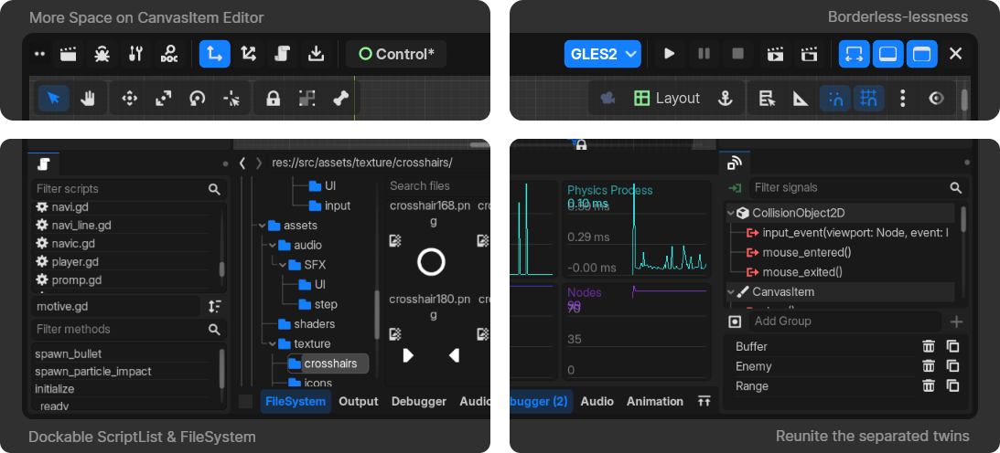

# GDX Changelogs

All notable changes to this project will be documented in this file.

please refer to the linked Pull Requests (PRs) For more information / documentation.

## Added

- Core
  - Alter `PACK_HEADER` https://github.com/naiiveprojects/GDX/pull/66
- Module
  - MiniZip https://github.com/naiiveprojects/GDX/pull/70
- Node
  - `Node` Backport 4.x Pause Mode https://github.com/naiiveprojects/GDX/pull/88
  - `Button` Add icon_pressed option https://github.com/naiiveprojects/GDX/pull/127
  - `ProgressBar` Fill Direction https://github.com/naiiveprojects/GDX/pull/67
  - `AudioStreamPlayer` Control Left and Right Volume https://github.com/naiiveprojects/GDX/pull/68
  - `TextEdit` Code completion filter https://github.com/naiiveprojects/GDX/pull/84
  - `SplitContainer` Add "drag_area" for hit detection https://github.com/naiiveprojects/GDX/pull/117
  - `TabContainer` Add Icon color properties https://github.com/naiiveprojects/GDX/pull/121
- Editor https://github.com/naiiveprojects/GDX/pull/123
  - Borderless mode https://github.com/naiiveprojects/GDX/pull/77 https://github.com/naiiveprojects/GDX/pull/106 https://github.com/naiiveprojects/GDX/pull/111
  - `Dock` Icons https://github.com/naiiveprojects/GDX/pull/77
  - `BottomDock`
    - Add Align setting https://github.com/naiiveprojects/GDX/pull/125
    - Visibility toggle https://github.com/naiiveprojects/GDX/pull/77
  - `SceneTree` NodePath export hint https://github.com/naiiveprojects/GDX/pull/87
  - `FileSystem` Bottom Dock https://github.com/naiiveprojects/GDX/pull/75
  - `CanvasItemEditor` ( 2D ) Collapse tool menu into the viewport https://github.com/naiiveprojects/GDX/pull/74 https://github.com/naiiveprojects/GDX/pull/119
  - Corner Radius Setting https://github.com/naiiveprojects/GDX/pull/107
  - `SceneTabs` align setting https://github.com/naiiveprojects/GDX/pull/114
  - `ScriptEditor`
    - `ScriptList` Dock https://github.com/naiiveprojects/GDX/pull/73
    - Open valid URI https://github.com/naiiveprojects/GDX/pull/86
  - `InspectorDock` Add button to show/hide resource option https://github.com/naiiveprojects/GDX/pull/112
  - Most new settings on miscellaneous https://github.com/naiiveprojects/GDX/pull/124
  - Themes https://github.com/naiiveprojects/GDX/pull/120
- OS Windows
  - Dark mode in window title bar https://github.com/naiiveprojects/GDX/pull/72
  - Collapse client area to non client area https://github.com/naiiveprojects/GDX/pull/72
  - Resizable borderless window https://github.com/naiiveprojects/GDX/pull/72
- OS Android
  - Proguard https://github.com/naiiveprojects/GDX/pull/69

## Changed

- GDX Adjustment https://github.com/naiiveprojects/GDX/pull/78 https://github.com/naiiveprojects/GDX/pull/81
- Change default font to inter https://github.com/naiiveprojects/GDX/pull/96
- Increase icon saturation by 30% for all editor icons https://github.com/naiiveprojects/GDX/pull/99
- Node
  - Revamp color picker https://github.com/naiiveprojects/GDX/pull/108
- Main
- Default settings https://github.com/naiiveprojects/GDX/pull/71
- Editor
  - Default settings https://github.com/naiiveprojects/GDX/pull/71 https://github.com/naiiveprojects/GDX/pull/102
  - Revamp https://github.com/naiiveprojects/GDX/pull/77
  - Use project icon on project menu button https://github.com/naiiveprojects/GDX/pull/77
  - Improve class display in Create dialog https://github.com/naiiveprojects/GDX/pull/93
  - FileSystem
    - use icon for main_scene https://github.com/naiiveprojects/GDX/pull/105
  - Inspector
    - Category bg and algiment https://github.com/naiiveprojects/GDX/pull/94
    - Use Bold font for category https://github.com/naiiveprojects/GDX/pull/116
  - Simplify `NodeDock` (Signals & Groups) https://github.com/naiiveprojects/GDX/pull/113
  - Simplify `EditorLog` https://github.com/naiiveprojects/GDX/pull/118
- Project Manager
  - Default settings https://github.com/naiiveprojects/GDX/pull/71
  - Revamp https://github.com/naiiveprojects/GDX/pull/76
  - Not include default icon & environment when creating project https://github.com/naiiveprojects/GDX/pull/76
- Github Actions
  - Updated CI/CD workflows https://github.com/naiiveprojects/GDX/pull/65 https://github.com/naiiveprojects/GDX/pull/79

## Fixed

- Performance issues with create dialog https://github.com/naiiveprojects/GDX/pull/85
- Incorrect `MOUSE_ENTER`/`MOUSE_EXIT` notifications https://github.com/naiiveprojects/GDX/pull/89
- Window not centered when run on editor with HiDPI https://github.com/naiiveprojects/GDX/pull/100
- HiDPI issue in editor Color Picker https://github.com/naiiveprojects/GDX/pull/115

## Removed

- `VisualScript` https://github.com/naiiveprojects/GDX/pull/64

